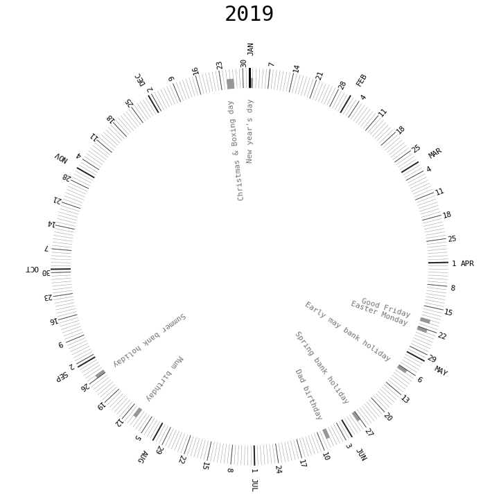

# circular_calendar
A Python script to visualise a year calendar in a circular layout. This gives me a more intuitive view of the year's progress. 

The output of the script looks like this: 

 

This can be printed out and filled in as days go by. 